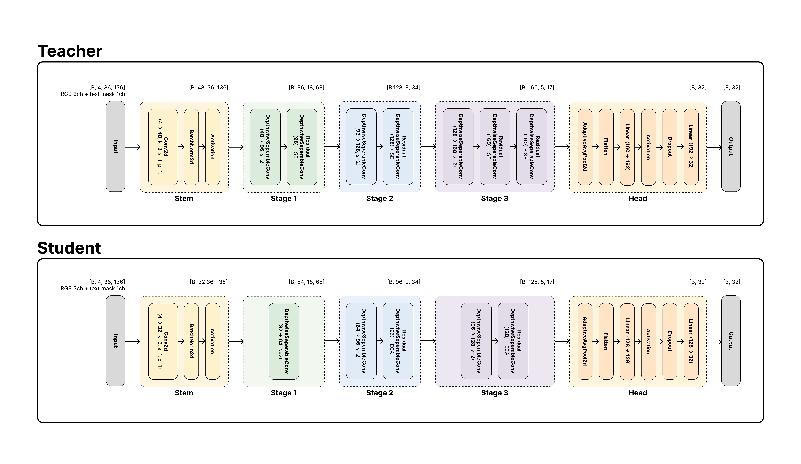

# [KAU] LighTrip AI Repository

한국항공대학교 산학 프로젝트 **LighTrip AI** 레포지토리입니다.

여권 대표 이미지 제목에 어울리는 텍스트 색상을 추천하고,  
이미지 기반으로 블로그/SNS 스타일 초안과 카테고리를 생성하는 AI 기능을 제공합니다.

## 목차

1. [Core Features](#1-core-features)
2. [TitLeNet (Title Color Recommendation)](#2-titlenet-title-color-recommendation)
3. [API Serving](#3-api-serving)
4. [Category Classification](#4-category-classification)
5. [Project Structure](#5-project-structure)
6. [Feature Layout](#6-feature-layout)
7. [Places365 Dataset Pipeline](#7-places365-dataset-pipeline)
8. [Reports](#8-reports)
9. [Tech Stack](#9-tech-stack)
10. [Development Workflow](#10-development-workflow)


## Developer

|  |
| :-: |
| 정윤성<br/>[@coouir](https://github.com/coouir) |

---

## 1. Core Features

| Feature | Model / Method | Description |
| --- | --- | --- |
| Title Color Recommendation | TitLeNet / TitLeNet Student ONNX | 제목 ROI의 RGB + mask 정보를 기반으로 32색 palette 중 top-1 제목 색상 추천 |
| Image -> Draft + Category | Gemma 4 E2B (GGUF) | 사용자 이미지와 입력 텍스트를 기반으로 블로그/SNS 스타일 초안 생성과 카테고리 분류 |
| Category Fallback | TF-IDF + calibrated Linear SVM | Gemma가 카테고리를 누락하거나 허용되지 않은 값을 출력한 경우 fallback 분류 및 저신뢰도 `기타` 처리 |

---

## 2. TitLeNet (Title Color Recommendation)

TitLeNet은 여권 대표 이미지 위에 배치될 제목 텍스트 색상을 추천하는 AI 기능입니다.  
제목 영역 ROI의 RGB 정보와 text mask를 결합한 4채널 입력을 사용해 32개 고정 palette 중 top-1 색상 index를 예측합니다.



### 2.1 Mobile Inference Contract

| Item | Value |
| --- | --- |
| Input shape | `[1, 4, 36, 136]` |
| Layout | `NCHW` |
| Dtype | `float32` |
| Channel order | `R, G, B, mask` |
| Output | `top1_index [1] int64` |
| Palette count | `32` |
| Postprocess | `top1_index`로 `palette.json`의 `id` 조회 |

### 2.2 Deployment Bundle

| File | Purpose |
| --- | --- |
| `outputs/title_color_recommendation/deployment/titlenet_student_qat_fp16_top1.onnx` | 앱 최종 추론용 top-1 ONNX 모델 |
| `outputs/title_color_recommendation/deployment/palette.json` | 모델 출력 index와 실제 hex 색상 매핑 |
| `outputs/title_color_recommendation/deployment/titlenet_student_qat_fp16_metadata.json` | 연동 확인용 metadata |
| `docs/title_color_recommendation/titlenet_mobile_inference_spec.md` | 입력/출력/ROI/palette 공통 스펙 |

---

## 3. API Serving

FastAPI 앱은 Gemma Direct 기반 통합 AI 파이프라인 API를 제공합니다.

### 3.1 Install

```bash
pip install -r requirements-api.txt
```

### 3.2 Run

모델 파일명, 경로, 추론 파라미터는 GitHub에 올리지 않고 실행 환경에서만 설정합니다.
아래 환경변수들은 로컬 `.env`, 서버 secret, 또는 shell export로 주입합니다.

Required environment variables:

```text
GEMMA_MODEL_PATH
GEMMA_MMPROJ_PATH
GEMMA_PROMPT_PATH
GEMMA_N_CTX
GEMMA_MAX_TOKENS
GEMMA_TEMPERATURE
GEMMA_TOP_P
GEMMA_TOP_K
GEMMA_REPEAT_PENALTY
GEMMA_STOP_TOKENS
GEMMA_N_GPU_LAYERS
GEMMA_MAIN_GPU
GEMMA_OFFLOAD_KQV
GEMMA_MMPROJ_USE_GPU
CATEGORY_ARTIFACT_PATH
CATEGORY_UNKNOWN_LABEL
```

Optional environment variables:

```text
CATEGORY_UNKNOWN_THRESHOLD
```

Fallback 운영에는 calibrated SVM artifact를 사용합니다.

```bash
export CATEGORY_ARTIFACT_PATH=experiments/category_classifier/artifacts/places365_2_manual_full_calibrated/calibrated_linear_svm_tfidf.joblib
export CATEGORY_UNKNOWN_LABEL=기타
```

Gemma Direct는 기본 초안 프롬프트에 JSON 출력 규칙을 추가하므로, `draft_prompt_boundary_v2.txt` 사용 시 `GEMMA_N_CTX`는 최소 `2048` 이상을 권장합니다.

```bash
uvicorn app.main:app --host 0.0.0.0 --port 8000
```

### 3.3 Endpoints

| Method | Path | Description |
| --- | --- | --- |
| `GET` | `/` | 서버 실행 상태 확인 |
| `GET` | `/health` | Gemma, 카테고리 fallback, 임베딩 모델 로드 상태 확인 |
| `POST` | `/pipeline/generate` | Gemma Direct로 초안과 카테고리를 생성하고, 카테고리 이상 출력 시 calibrated Linear SVM fallback 적용 |
| `POST` | `/get-embedding` | 입력 텍스트 리스트를 Gemma 모델로 임베딩해 차원(`dim`)과 벡터 배열 반환 |

### 3.4 Pipeline Request

`multipart/form-data` 형식으로 요청합니다.

| Field | Type | Required | Description |
| --- | --- | --- | --- |
| `image` | File | Yes | `jpg`, `jpeg`, `png`, `webp` 이미지. OpenAPI/Swagger에서는 `string($binary)`로 표시될 수 있음 |
| `text` | string | No | 초안 생성에 반영할 사용자 요청 |
| `references` | string | No | pgvector 검색 결과 등 참고자료 문자열. 여러 청크는 빈 줄로 구분하면 프롬프트에서 `[1]`, `[2]` 형식으로 분리됨 |

```bash
curl -X POST "http://localhost:8000/pipeline/generate" \
  -F "image=@sample.jpg" \
  -F "text=따뜻한 일상 기록 느낌으로 작성해줘" \
  -F "references=창가 좌석과 따뜻한 조명이 있는 조용한 카페 공간"
```

SVM fallback threshold는 API 입력으로 받지 않고 `CATEGORY_UNKNOWN_THRESHOLD` 환경변수로 관리합니다. fallback 여부와 SVM 진단 정보는 서버 로그에만 기록됩니다.

### 3.5 Pipeline Response

응답은 서비스 연동에 필요한 초안과 카테고리만 반환합니다.

```json
{
  "draft": "오늘은 커피 향이 유난히 좋았다.\n잠깐 쉬어가는 시간이 이렇게 반가울 줄 몰랐다.",
  "category": "카페"
}
```

운영 label set은 `카페, 식당, 술집, 문화, 운동, 쇼핑, 공원, 기타`입니다.  
Gemma가 `category`를 비우거나, `category` 필드를 누락하거나, 허용 label set 밖의 값을 출력하면 SVM fallback 결과를 최종 `category`로 반환합니다.

`calibrated_linear_svm` artifact는 fallback 발생 시 `predict_proba` 기반 confidence를 반환하며, confidence가 threshold보다 낮으면 최종 카테고리를 `기타`로 바꿉니다.  
기본 `linear_svm` artifact는 `predict_proba`를 제공하지 않으므로 fallback 운영에는 calibrated artifact를 사용합니다.

### 3.6 Embedding Request

`application/json` 형식으로 요청합니다. `texts`는 최소 1개 이상의 문자열 리스트입니다. 임베딩은 별도 모델 없이 기존 Gemma 환경변수(`GEMMA_MODEL_PATH` 등)를 재사용합니다.

```bash
curl -X POST "http://localhost:8000/get-embedding" \
  -H "Content-Type: application/json" \
  -d '{"texts": ["조용한 카페", "따뜻한 조명"]}'
```

### 3.7 Embedding Response

`dim`은 임베딩 벡터 차원(`1536`)이고, `embeddings`는 입력 순서에 대응하는 벡터 배열입니다.

```json
{
  "dim": 1536,
  "embeddings": [[0.0123, -0.0456, "..."], [0.0789, -0.0011, "..."]]
}
```

---

## 4. Category Classification

### 4.1 Fallback Model

- Fallback model: **TF-IDF + calibrated Linear SVM**
- Service labels: 카페, 식당, 술집, 문화, 운동, 쇼핑, 공원, 기타
- Training/evaluation labels: 카페, 식당, 술집, 문화, 운동, 쇼핑, 공원
- Model selection report: `docs/category_classifier/카테고리_분류_모델_5폴드_교차_검증_결과.md`
- Runtime artifact: `experiments/category_classifier/artifacts/places365_2_manual_full_calibrated/calibrated_linear_svm_tfidf.joblib`
- Training data: `data/category_classifier/places365_v2/processed/train.jsonl` (`2747` rows)
- Validation data: `data/category_classifier/places365_v2/processed/valid.jsonl` (`339` rows)
- Test data: `data/category_classifier/places365_v2/processed/test.jsonl` (`339` rows)

### 4.2 Model Selection Summary

Naive Bayes, Logistic Regression, Linear SVM을 동일 데이터셋 기준으로 비교했고, 5-fold Stratified 교차 검증 결과 **Linear SVM**을 fallback 모델 계열로 선정했습니다. 운영에서는 confidence 기반 `기타` 처리를 위해 calibrated artifact를 사용합니다.

| Metric | Calibrated Linear SVM |
| --- | --- |
| Test Accuracy | `0.8643` |
| Test Macro F1 | `0.8500` |
| Valid Accuracy | `0.8289` |
| Valid Macro F1 | `0.8292` |

선정 기준은 Macro F1 평균을 최우선으로 두고, Accuracy 평균, fold별 표준편차, 추론 속도와 학습 시간을 운영 관점의 보조 지표로 함께 고려했습니다.

---

## 5. Project Structure

```text
LighTrip-AI/
├── app/
│   ├── api/
│   │   ├── embedding.py
│   │   └── pipeline.py
│   ├── config/
│   │   ├── gemma_config.py
│   │   └── gemma_runtime.py
│   ├── prompts/
│   │   ├── gemma_formatter.py
│   │   └── gemma_prompt.py
│   ├── services/
│   │   ├── blog_pipeline_service.py
│   │   ├── category_policy.py
│   │   ├── category_service.py
│   │   ├── embedding_service.py
│   │   └── gemma_service.py
│   └── main.py
├── configs/
│   ├── title_color_recommendation/
│   │   ├── default.yaml
│   │   ├── full_training.yaml
│   │   ├── titlenet_ablation.yaml
│   │   ├── titlenet_student_distillation.yaml
│   │   ├── titlenet_mobile_inference.json
│   │   └── *.json / *.yaml (sweep, model_comparison 등)
│   ├── draft_prompt.txt
│   ├── draft_prompt_boundary_v2.txt
│   ├── dataset_categories.json
│   ├── places365_categories.json
│   ├── places365_categories_v2.json
│   └── places365_category_mapping_v2.json
├── data/
│   ├── category_classifier/
│   │   ├── open_images/
│   │   │   ├── images/
│   │   │   ├── interim/
│   │   │   └── processed/
│   │   ├── places365_v1/
│   │   └── places365_v2/
│   │       ├── <label>/
│   │       ├── final_filtered/
│   │       ├── interim/
│   │       ├── manual_review*/
│   │       ├── processed/
│   │       ├── processed_service_prompt/
│   │       ├── quality/
│   │       ├── semantic_filter/
│   │       └── splits/
│   └── title_color_recommendation/
│       ├── raw/
│       │   └── places365/
│       ├── processed/
│       │   ├── clean_images/
│       │   ├── labels/
│       │   ├── masks/
│       │   ├── rois/
│       │   └── palette.json
│       └── splits/
├── docs/
│   ├── category_classifier/
│   │   ├── cv_5fold/
│   │   └── *.md
│   └── title_color_recommendation/
│       └── *.md
├── experiments/
│   ├── category_classifier/
│   ├── gemma/
│   ├── gemma_category_compare/
│   └── title_color_recommendation/
├── models/
├── outputs/
│   ├── checkpoints/
│   ├── hparam_sweep/
│   ├── logs/
│   ├── reports/
│   └── title_color_recommendation/
│       ├── checkpoints/
│       ├── deployment/
│       ├── onnx/
│       ├── previews/
│       ├── quantization/
│       └── reports/
├── scripts/
│   ├── dataset/
│   └── title_color_recommendation/
├── src/
│   ├── category_classifier/
│   │   ├── data.py
│   │   ├── evaluate.py
│   │   ├── models.py
│   │   └── preprocess.py
│   ├── models/
│   │   ├── fixed_palette_classifier.py
│   │   ├── title_color_initialization.py
│   │   ├── title_color_model_registry.py
│   │   └── title_color_models.py
│   └── title_color_recommendation/
│       ├── data/
│       ├── evaluation/
│       ├── inference/
│       ├── labeling/
│       ├── models/
│       └── training/
├── tests/
├── requirements-api.txt
├── requirements-classifier.txt
├── requirements-dataset.txt
├── run_api.local.sh
└── README.md
```

| Path | Description |
| --- | --- |
| `app/` | FastAPI serving 코드 (초안 생성, 카테고리 분류, 임베딩 endpoint·서비스 계층) |
| `configs/` | 카테고리 매핑·프롬프트 등 분류 설정과 색상 추천 학습/추론 config |
| `data/` | 카테고리 분류(Open Images, Places365)와 색상 추천 데이터셋 |
| `docs/` | 카테고리 분류 및 TitLeNet 색상 추천 실험·스펙 문서 |
| `experiments/` | Gemma 초안, 카테고리 분류/비교, 색상 추천 실험 코드 및 결과 |
| `models/` | 로컬 Gemma GGUF, mmproj, SVM artifact |
| `outputs/` | 색상 추천 학습 checkpoint, sweep, 리포트, 배포용 ONNX·양자화 번들 |
| `scripts/` | 데이터 수집/가공 스크립트 (카테고리 데이터셋, 색상 추천 전처리·export) |
| `src/` | 재사용 로직 (카테고리 분류, TitLeNet 모델 정의, 색상 추천 데이터·학습·평가) |
| `tests/` | 서비스 정책 및 pipeline·title color 단위 테스트 |

---

## 6. Feature Layout

`app/`은 모든 AI 기능이 함께 사용하는 serving 계층입니다.  
카테고리 분류의 재사용 로직과 데이터셋은 각각 `src/category_classifier/`, `data/category_classifier/` 아래에 묶습니다.  
새 텍스트 색상 추천 기능은 기능명 기준으로 별도 디렉터리에 개발합니다.

| Feature | Main Development Paths |
| --- | --- |
| Draft generation | `app/prompts/`, `app/services/`, `experiments/gemma/` |
| Category classification | `app/services/`, `src/category_classifier/`, `data/category_classifier/`, `experiments/category_classifier/`, `experiments/gemma_category_compare/`, `scripts/dataset/` |
| Title color recommendation | `src/title_color_recommendation/`, `configs/title_color_recommendation/`, `data/title_color_recommendation/`, `outputs/title_color_recommendation/`, `experiments/title_color_recommendation/` |

---

## 7. Places365 Dataset Pipeline

### 7.1 Goal

Places365 scene 이미지를 LighTrip의 세 가지 AI 기능 데이터로 가공합니다.

- **초안 생성**: 서비스 카테고리로 매핑한 이미지에서 Gemma 기반 한국어 블로그 초안을 생성
- **카테고리 분류**: 위 초안을 카테고리 fallback 학습용 JSONL 데이터셋으로 구축
- **TitLeNet 색상 추천**: 이미지를 제목 배경으로 수집해 ROI/mask/soft-label을 만들고 색상 추천 학습 데이터로 사용

초안 생성과 카테고리 분류는 동일한 `places365_v2` 데이터셋을 공유하고, TitLeNet은 배경 용도로 별도 수집한 Places365 이미지를 사용합니다.

### 7.2 Category & Draft Dataset (places365_v2)

Places365 scene 카테고리를 LighTrip 서비스 카테고리에 매핑한 뒤, manual review와 filtering을 거쳐 Gemma 초안을 생성하고 카테고리 fallback 학습용 JSONL을 구축합니다.

- Data source: Places365 scene categories mapped to LighTrip service categories
- Dataset root: `data/category_classifier/places365_v2/`
- Mapping config: `configs/places365_categories_v2.json`
- Dataset labels: 카페, 식당, 술집, 문화, 운동, 쇼핑, 공원
- Service inference labels: 카페, 식당, 술집, 문화, 운동, 쇼핑, 공원, 기타
- Processed split: `train=2747`, `valid=339`, `test=339`
- Draft prompt policy: `configs/draft_prompt_boundary_v2.txt` 기준의 카테고리 경계 규칙을 반영

서비스 API의 기본 프롬프트는 데이터셋 생성용 힌트와 분리해 유지합니다.

### 7.3 TitLeNet Background Dataset

제목 텍스트가 올라갈 배경 분포를 확보하기 위해 Places365 scene 이미지를 배경 카테고리 기준으로 별도 수집한 뒤, 품질 필터링과 ROI/mask/soft-label 생성을 거쳐 색상 추천 학습 데이터로 사용합니다.

- Data source: `Andron00e/Places365-custom` scene 이미지를 배경 카테고리로 매핑
- Mapping config: `configs/title_color_recommendation/places365_background_categories.json`
- Background categories: nature, city, food, people, product, fashion, travel, interior, abstract, sports (`target_total=30000`)
- Raw root: `data/title_color_recommendation/raw/places365/`
- Processed: `clean_images/` → `rois/` + `masks/` → `labels/` (32색 palette soft-label) + `palette.json`
- Pipeline scripts: `scripts/title_color_recommendation/`
  - `collect_places365_backgrounds.py` → `filter_background_images.py` → `generate_roi_masks.py` → `generate_soft_labels.py` → `create_split_manifests.py`

### 7.4 Category Dataset Structure

```text
data/category_classifier/places365_v2/
├── 카페/
│   ├── coffee_shop/
├── 식당/
│   ├── diner_outdoor/
│   ├── fastfood_restaurant/
│   ├── food_court/
│   ├── pizzeria/
│   ├── restaurant/
│   └── restaurant_patio/
├── 술집/
│   ├── bar/
│   ├── beer_garden/
│   ├── beer_hall/
│   └── pub_indoor/
├── 문화/
│   ├── amphitheater/
│   ├── art_gallery/
│   ├── library_indoor/
│   ├── movie_theater_indoor/
│   ├── museum_indoor/
│   ├── natural_history_museum/
│   └── science_museum/
├── 운동/
│   ├── athletic_field_outdoor/
│   ├── baseball_field/
│   ├── basketball_court_indoor/
│   ├── bowling_alley/
│   ├── boxing_ring/
│   ├── football_field/
│   ├── golf_course/
│   ├── gymnasium_indoor/
│   ├── ice_skating_rink_indoor/
│   ├── ice_skating_rink_outdoor/
│   ├── martial_arts_gym/
│   ├── ski_slope/
│   ├── soccer_field/
│   ├── swimming_pool_indoor/
│   ├── swimming_pool_outdoor/
│   └── volleyball_court_outdoor/
├── 쇼핑/
│   ├── bazaar_indoor/
│   ├── bazaar_outdoor/
│   ├── clothing_store/
│   ├── department_store/
│   ├── flea_market_indoor/
│   ├── general_store_indoor/
│   ├── gift_shop/
│   ├── jewelry_shop/
│   ├── market_indoor/
│   ├── market_outdoor/
│   ├── shoe_shop/
│   ├── shopping_mall_indoor/
│   ├── supermarket/
│   └── toyshop/
├── 공원/
│   ├── botanical_garden/
│   ├── formal_garden/
│   ├── japanese_garden/
│   ├── park/
│   ├── picnic_area/
│   ├── playground/
│   ├── topiary_garden/
│   └── zen_garden/
├── final_filtered/
├── manual_review_full/
├── splits/
│   ├── train.jsonl
│   ├── valid.jsonl
│   └── test.jsonl
├── processed/
│   ├── train.jsonl
│   ├── valid.jsonl
│   └── test.jsonl
└── interim/
```

---

## 8. Reports

### 8.1 Category Classification

| Report | Path |
| --- | --- |
| 5-fold model selection report | `docs/category_classifier/카테고리_분류_모델_5폴드_교차_검증_결과.md` |
| CV summary CSV | `docs/category_classifier/cv_5fold/모델별_성능_요약.csv` |
| Fold-level CV results | `docs/category_classifier/cv_5fold/폴드별_성능_결과.csv` |
| CV result JSON | `docs/category_classifier/cv_5fold/5폴드_전체_결과.json` |
| Gemma Direct vs Gemma+SVM 비교 | `docs/category_classifier/Gemma_Direct와_Gemma_SVM_파이프라인_비교_결과.md` |
| `기타` fallback threshold 튜닝 | `docs/category_classifier/기타_폴백_임계값_튜닝_결과.md` |
| places365_v2 데이터셋 품질 검토 | `docs/category_classifier/places365_v2_데이터셋_품질_검토.md` |

### 8.2 Title Color Recommendation (TitLeNet)

| Report | Path |
| --- | --- |
| TitLeNet 실험 요약 | `docs/title_color_recommendation/titlenet_experiment_summary.md` |
| Student distillation | `docs/title_color_recommendation/titlenet_student_distillation.md` |
| Student quantization 준비 | `docs/title_color_recommendation/titlenet_student_quantization_prep.md` |
| ONNX export | `docs/title_color_recommendation/titlenet_onnx_export.md` |
| ONNX parity validation | `docs/title_color_recommendation/titlenet_onnx_parity_validation.md` |
| Mobile inference spec | `docs/title_color_recommendation/titlenet_mobile_inference_spec.md` |
| QAT fp16 React Native 핸드오프 | `docs/title_color_recommendation/titlenet_qat_fp16_react_native_handoff.md` |
| Ablation 결과 | `outputs/reports/titlenet_ablation_report.md`, `outputs/reports/titlenet_ablation_results.csv` |
| nDCG 모델 비교 | `outputs/reports/ndcg_model_eval_comparison.md` |

---

## 9. Tech Stack

| Area | Tools |
| --- | --- |
| Image/draft generation | GGUF Gemma, llama-cpp-python |
| Category classification | scikit-learn, joblib |
| Dataset collection/processing | Hugging Face Datasets, FiftyOne, Pillow |
| Evaluation/visualization | scikit-learn, matplotlib |
| Serving | FastAPI, Uvicorn |
| Title color recommendation | PyTorch, ONNX, ONNX Runtime, Pillow |

---

## 10. Development Workflow

### 10.1 Git-flow Strategy

- `main`: 최종적으로 사용자에게 배포되는 가장 안정적인 버전 브랜치
- `develop`: 다음 출시 버전을 개발하는 중심 브랜치
- `feature/*`: 기능 개발용 브랜치

### 10.2 Branch Rules

1. 모든 기능 개발은 `feature` 브랜치에서 시작합니다.
2. 작업 시작 전 최신 `develop` 내용을 반영합니다.
3. 작업 완료 후 `develop`으로 Pull Request를 생성합니다.
4. PR에 Reviewer를 지정한 뒤 리뷰를 거쳐 머지합니다.

브랜치 이름 형식:

```text
feature/이슈번호-기능명
```

예시:

```text
feature/1-login
```

### 10.3 Commit Convention

- `type`은 소문자만 사용합니다.
- `subject`는 현재형 동사로 작성합니다.

| Type | Description |
| --- | --- |
| `start` | 새로운 프로젝트를 시작할 때 |
| `feat` | 새로운 기능을 추가할 때 |
| `fix` | 버그를 수정할 때 |
| `refactor` | 기능 변경 없이 코드를 리팩토링할 때 |
| `settings` | 설정 파일을 변경할 때 |
| `experiment` | 실험 코드나 실험 설정을 추가/변경할 때 |
| `comment` | 필요한 주석을 추가하거나 변경할 때 |
| `docs` | README.md 등 문서를 수정할 때 |
| `merge` | 브랜치를 병합할 때 |
| `rename` | 파일 혹은 폴더명을 수정하거나 옮길 때 |
| `remove` | 파일을 삭제하는 작업만 수행했을 때 |
| `revert` | 이전 버전으로 롤백할 때 |

예시:

```bash
feat: 로그인 기능 추가
fix: 로그인 버그 수정
refactor: 로그인 로직 리팩토링
```
